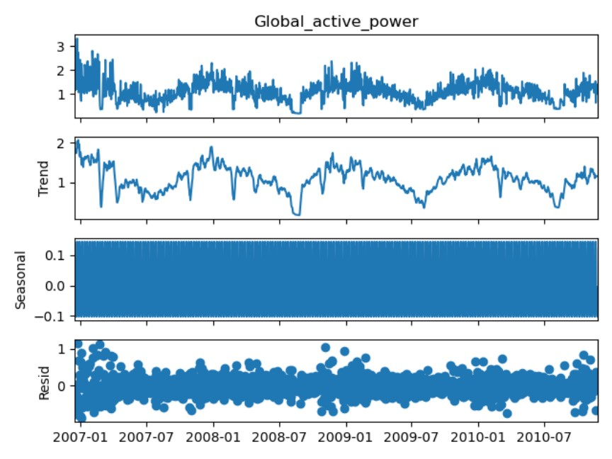
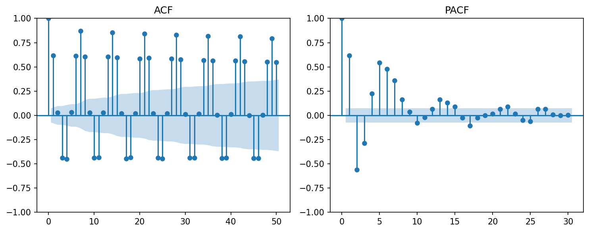
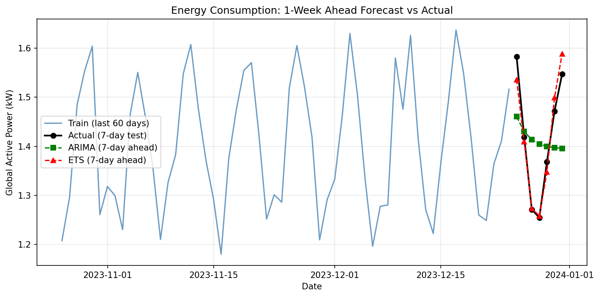

# Energy Consumption Forecasting — Full Notebook (Time Series)

**Household electricity consumption: data cleaning, model theory, ACF/PACF analysis, and 7-day forecasting with ARIMA, ETS, and Prophet.**

This document is organized in a Jupyter Notebook–style: each section has Markdown explanation, code cells, and sample outputs.

---

# Part 1 — Data Cleaning: Construction of the Analysis-Ready Time Series

## Step 1: Load Raw Data

Load the UCI Household Electric Power Consumption file. The file is semicolon-separated; missing values are encoded as `?`. Use `low_memory=False` to avoid mixed-type warnings when reading.

```python
import pandas as pd

file_path = "/path/to/household_power_consumption.txt"  # replace with your data path

df = pd.read_csv(
    file_path,
    sep=";",
    na_values=["?"],
    low_memory=False
)

print(df.head())
print(df.info())
```

**Sample output:**

```
         Date      Time  Global_active_power  ...  Sub_metering_1  Sub_metering_2  Sub_metering_3
0  16/12/2006  17:24:00                4.216  ...             0.0             1.0            17.0
1  16/12/2006  17:25:00                5.360  ...             0.0             1.0            16.0
...
[5 rows x 9 columns]

<class 'pandas.core.frame.DataFrame'>
RangeIndex: 2075259 entries, 0 to 2075258
Data columns (total 9 columns):
 #   Column                 Dtype
---  ------                 -----
 0   Date                   object
 1   Time                   object
 2   Global_active_power    float64
 ...
dtypes: float64(7), object(2)
```

We have **2,075,259 rows** (minute-level) and **9 columns**: `Date`, `Time`, and 7 numeric variables. We need to combine `Date` and `Time` into a single datetime index.

---

## Step 2: Build a Datetime Index (Date + Time → datetime)

Combine `Date` and `Time` into a single `datetime` column with `dayfirst=True` (format DD/MM/YYYY). Drop rows that fail to parse, set the index to `datetime`, and remove the original `Date` and `Time` columns.

```python
df["datetime"] = pd.to_datetime(
    df["Date"] + " " + df["Time"],
    dayfirst=True,
    errors="coerce"
)

bad_dt = df["datetime"].isna().sum()
print("Bad datetime rows:", bad_dt)

df = df.dropna(subset=["datetime"]).set_index("datetime").sort_index()
df = df.drop(columns=["Date", "Time"])

print(df.head())
print(df.index.min(), "to", df.index.max())
print(df.info())
```

**Sample output:**

```
Bad datetime rows: 0
```

(DataFrame head with `datetime` as index, 7 numeric columns.)

```
2006-12-16 17:24:00 to 2010-11-26 21:02:00
DatetimeIndex: 2075259 entries, 2006-12-16 17:24:00 to 2010-11-26 21:02:00
Data columns (total 7 columns): ...
dtypes: float64(7)
```

The series is continuously indexed with no invalid datetime rows.

---

## Step 3: Check Missing Values

Count missing values and their percentage per column to see whether gaps are variable-specific or system-wide (e.g. instrument downtime).

```python
print("Missing values by column:")
print(df.isna().sum())

print("\nMissing percentage:")
print((df.isna().mean() * 100).round(3))
```

**Sample output:**

```
Missing values by column:
Global_active_power      25979
Global_reactive_power    25979
Voltage                  25979
Global_intensity         25979
Sub_metering_1           25979
Sub_metering_2           25979
Sub_metering_3           25979
dtype: int64

Missing percentage:
Global_active_power      1.252
... (all columns 1.252)
```

| Summary        | Value     |
|----------------|-----------|
| Missing count  | 25,979    |
| Total rows     | 2,075,259 |
| Missing %      | ≈ 1.252%  |

All seven variables have the same missing count, so gaps are **system-wide** (e.g. meter not recording). With missing % &lt; 5%, it is reasonable to **interpolate** after resampling to daily frequency.

---

## Step 4: Frequency Transformation (Minute → Daily)

The goal is **7-day ahead forecasting**, so we use **daily** frequency. Resample `Global_active_power` to **daily mean** and check the series length.

```python
power = df["Global_active_power"]
daily = power.resample("D").mean()

print("Daily series preview:")
print(daily.head())
print("\nNumber of daily observations:", len(daily))
```

**Sample output:**

```
Daily series preview:
datetime
2006-12-16    3.161306
...
Number of daily observations: 1442
```

From 2006-12 to 2010-11 (~4 years × 365 ≈ 1460 days) we get **1,442 daily observations**, suitable for modeling.

| Meaning    | Description   |
|------------|---------------|
| Time span  | ~4 years      |
| Frequency  | Daily         |
| Data size  | Sufficient    |

---

## Step 5: Daily Missing Values and Interpolation

After resampling, the daily series may still have a few missing days (e.g. days where all minute values were missing). Count them and fill with time-based interpolation.

```python
print("Daily missing:", daily.isna().sum())

daily = daily.interpolate(method="time")
print("Remaining missing:", daily.isna().sum())
```

Typical result: e.g. **9 missing days** out of 1442 (~0.62%), then **0** after interpolation. The final **daily series is complete** and ready for decomposition and modeling.

---

## Step 6: Seasonal Decomposition (Observed, Trend, Seasonal, Residual)

Decompose the daily series with **additive** decomposition and **period = 7** (weekly seasonality).

```python
from statsmodels.tsa.seasonal import seasonal_decompose
import matplotlib.pyplot as plt

result = seasonal_decompose(
    daily,
    model="additive",
    period=7
)
result.plot()
plt.show()
```

**Component interpretation:**

1. **Observed** — Raw daily average household electricity consumption (~2006–2010), typically 1–2 kW; no strong long-run trend.
2. **Trend** — Long-term evolution after removing seasonality; smooth, supporting models that assume a slowly varying level.
3. **Seasonal** — Strong, regular **weekly** pattern (period=7); usage differs by day of week (e.g. weekdays vs weekends), consistent with models that include weekly seasonality (e.g. ETS, Prophet).
4. **Residual** — Remainder after trend and seasonality; used for diagnostics.

**Figure 1 — Seasonal decomposition (Observed, Trend, Seasonal, Residual):**



---

# Part 2 — Model Theory and Applicability to Energy Consumption Forecasting

## Part A: Model Introduction and Applicability

This section gives theoretical background on three time series forecasting models (ARIMA, ETS, Prophet) and their suitability for household electricity consumption forecasting, and uses ACF/PACF to guide model choice.

---

## 1. ARIMA (AutoRegressive Integrated Moving Average)

### 1.1 Model Overview

ARIMA combines three components:

- **AR (AutoRegressive)**: The current value depends on its own past values.
- **I (Integrated)**: Differencing to achieve stationarity.
- **MA (Moving Average)**: The current value depends on past forecast errors.

General form: \(\phi(B)(1-B)^d Y_t = \theta(B)\varepsilon_t\), where \(p\) = AR order, \(d\) = differencing order, \(q\) = MA order, \(B\) = backshift operator, \(\varepsilon_t\) = white noise.

### 1.2 Applicable Scenarios

| Scenario | Suitability |
|----------|-------------|
| Stationary or near-stationary series | ✓ Excellent |
| Series with trend (after differencing) | ✓ Good |
| Short-term forecasting | ✓ Excellent |
| Long-term forecasting | ✗ Poor (mean-reverting) |
| Series with strong seasonality | △ Requires SARIMA |
| Series with multiple seasonalities | ✗ Limited |
| Series with external regressors | △ Requires ARIMAX |

### 1.3 Applicability to This Dataset

**Suitability: HIGH** ⭐⭐⭐⭐⭐

1. **Stationarity**: After first-order differencing, the daily series is stationary (ADF test supports this).
2. **Short-term forecast**: 7-day ahead forecasting is a strength of ARIMA.
3. **Autocorrelation**: ACF/PACF show structure that can be captured by AR and MA terms.
4. **Weekly seasonality**: Can be handled by SARIMA(p,d,q)(P,D,Q)[7].

**Limitations**: (p,d,q) must be chosen manually or by auto; assumes linearity; may not capture complex holiday effects.

---

## 2. ETS (Error, Trend, Seasonality) / Exponential Smoothing

### 2.1 Model Overview

ETS decomposes the series into Error, Trend, and Seasonal components, denoted ETS(E,T,S):

- **Error (E)**: Additive (A) or Multiplicative (M)
- **Trend (T)**: None (N), Additive (A), Additive Damped (Ad), or Multiplicative (M)
- **Seasonal (S)**: None (N), Additive (A), or Multiplicative (M)

Additive form: \(Y_t = l_{t-1} + b_{t-1} + s_{t-m} + \varepsilon_t\), where \(l_t\) = level, \(b_t\) = trend, \(s_t\) = seasonal, \(m\) = seasonal period.

### 2.2 Applicable Scenarios

| Scenario | Suitability |
|----------|-------------|
| Clear trend / seasonality | ✓ Excellent |
| Short to medium-term forecasting | ✓ Excellent |
| Automatic model selection (AIC/BIC) | ✓ Good |
| Non-stationary series | ✓ Good (no differencing) |
| Damped trend | ✓ Excellent |
| Multiple seasonalities | ✗ Limited (single period) |

### 2.3 Applicability to This Dataset

**Suitability: HIGH** ⭐⭐⭐⭐⭐

1. Clear **weekly seasonality** (7-day cycle) is well captured by seasonal ETS.
2. Smooth trend is well suited to exponential smoothing.
3. Decomposition shows **additive** seasonality.
4. Smoothing parameters can be optimized automatically.

**Recommended**: ETS(A,Ad,A) with period=7. **Limitations**: No exogenous variables; single seasonal period only.

---

## 3. Prophet

### 3.1 Model Overview

Prophet uses an additive decomposition: \(y(t) = g(t) + s(t) + h(t) + \varepsilon_t\), where \(g(t)\) = trend, \(s(t)\) = seasonality (Fourier), \(h(t)\) = holiday effects.

### 3.2 Applicable Scenarios

| Scenario | Suitability |
|----------|-------------|
| Multiple seasonalities (daily, weekly, yearly) | ✓ Excellent |
| Missing data / outliers | ✓ Excellent / Good |
| Holiday/event effects | ✓ Excellent |
| Long-term forecasting | ✓ Good |
| Short series (<2 years) | ✗ Limited |
| Precise short-term forecasts | △ Moderate |

### 3.3 Applicability to This Dataset

**Suitability: MODERATE** ⭐⭐⭐

**Advantages**: Multiple seasonalities; robust to missing data; easy to use; interpretable.  
**Limitations**: Trend can be over-extrapolated; in this project ARIMA/ETS perform better for 7-day forecasts; household consumption has no clear “holiday” effects.  
**Empirical**: Prophet’s MAE/RMSE/MAPE are higher than ARIMA and ETS, consistent with short-horizon trend over-extrapolation.

---

## 4. Model Comparison Summary

| Criterion | ARIMA | ETS | Prophet |
|-----------|-------|-----|--------|
| **Theoretical Foundation** | Box-Jenkins | State space | GAM |
| **Stationarity Requirement** | Yes (or differencing) | No | No |
| **Seasonality** | SARIMA | Built-in (single) | Multiple |
| **Parameter Selection** | Manual (ACF/PACF) or auto | AIC/BIC | Automatic |
| **Short-term Accuracy** | ⭐⭐⭐⭐⭐ | ⭐⭐⭐⭐⭐ | ⭐⭐⭐ |
| **Long-term Accuracy** | ⭐⭐ | ⭐⭐⭐ | ⭐⭐⭐⭐ |
| **Handling Missing Data** | Poor | Moderate | Excellent |
| **Suitability for This Dataset** | **HIGH** | **HIGH** | **MODERATE** |

**Recommendation for 7-day household electricity forecasting:**

1. **Primary choice: ARIMA or ETS** — Best short-term accuracy and low computational cost.  
2. **ETS(A,Ad,A)** is recommended for weekly seasonality and damped trend.  
3. **Prophet** is better for longer horizons or when holiday effects matter.  

---

# Part 3 — ACF and PACF Analysis

ACF (autocorrelation function) and PACF (partial autocorrelation function) are used to identify ARIMA orders.

## 5.1 ACF and PACF Theory

- **ACF** \(\rho_k\): Correlation between \(Y_t\) and \(Y_{t-k}\) (including indirect effects); \(\rho_k = \frac{\text{Cov}(Y_t, Y_{t-k})}{\text{Var}(Y_t)}\).
- **PACF**: Direct correlation between \(Y_t\) and \(Y_{t-k}\) after controlling for intermediate lags.

**Guidelines for ARIMA order selection:**

| Pattern | ACF | PACF | Suggested Model |
|---------|-----|------|------------------|
| Exponential decay | Gradual decline | Sharp cutoff at lag p | AR(p) |
| Sharp cutoff at lag q | Exponential decay | Gradual decline | MA(q) |
| Both decay | Gradual | Gradual | ARMA(p,q) |
| Slow decay | - | - | Non-stationary, differencing |

## Code: Load Libraries and Data

```python
import numpy as np
import pandas as pd
import matplotlib.pyplot as plt
from statsmodels.tsa.stattools import acf, pacf, adfuller
from statsmodels.graphics.tsaplots import plot_acf, plot_pacf
import warnings
warnings.filterwarnings('ignore')

plt.rcParams['figure.figsize'] = (14, 5)
plt.rcParams['font.size'] = 11
print("Libraries imported successfully!")
```

**Output:** `Libraries imported successfully!`

```python
# Assume daily series from Part 1 (Steps 4–5)
# daily = ...
print("Daily observations:", len(daily))
print("Date range:", daily.index.min().date(), "to", daily.index.max().date())
```

**Output (example):**

```
Daily observations: 1442
Date range: 2006-12-16 to 2010-11-26
```

## Code: ACF/PACF — Original Series

```python
fig, axes = plt.subplots(1, 2, figsize=(12, 4))
plot_acf(daily.dropna(), lags=40, ax=axes[0])
axes[0].set_title('ACF - Original Daily Series', fontsize=14, fontweight='bold')
plot_pacf(daily.dropna(), lags=40, ax=axes[1])
axes[1].set_title('PACF - Original Daily Series', fontsize=14, fontweight='bold')
plt.tight_layout()
plt.savefig('ACF_PACF_Original.png', dpi=150, bbox_inches='tight')
plt.show()

print("ACF/PACF Analysis - Original Series")
print("1. ACF shows very slow decay → indicates non-stationarity")
print("2. Significant spikes at lags 7, 14, 21, 28 → weekly seasonality")
print("3. PACF shows significant spike at lag 1, then smaller spikes at multiples of 7")
```

**Interpretation:** Original series ACF decays slowly → **non-stationary**; significant spikes at lags 7, 14, 21, 28 → **weekly seasonality**; PACF has a strong spike at lag 1 and smaller spikes at multiples of 7.

**Figure 2 — ACF and PACF (original daily series):**



## Code: First Differencing and ADF Test

```python
daily_diff = daily.diff().dropna()
adf_result = adfuller(daily_diff)
print("ADF Statistic:", round(adf_result[0], 4))
print("p-value:", round(adf_result[1], 6))
print("Stationary (p<0.05):", adf_result[1] < 0.05)
```

**Output (example):** ADF statistic significant, p &lt; 0.05 → series is **stationary** after first differencing; supports **d = 1**.

## Code: ACF/PACF — Differenced Series

```python
fig, axes = plt.subplots(1, 2, figsize=(12, 4))
plot_acf(daily_diff, lags=40, ax=axes[0])
axes[0].set_title('ACF - First Differenced Series', fontsize=14, fontweight='bold')
plot_pacf(daily_diff, lags=40, ax=axes[1])
axes[1].set_title('PACF - First Differenced Series', fontsize=14, fontweight='bold')
plt.tight_layout()
plt.savefig('ACF_PACF_Differenced.png', dpi=150, bbox_inches='tight')
plt.show()

print("ACF/PACF Analysis - First Differenced Series")
print("1. ACF now shows rapid decay → stationarity achieved")
print("2. Remaining seasonal spikes at 7, 14 → consider SARIMA seasonal terms")
print("3. PACF significant at lags 1-2 → suggests AR(1) or AR(2)")
```

**Interpretation:** After differencing, ACF decays quickly → stationarity; PACF significant at lags 1–2 → suggests **AR(1) or AR(2)**; with seasonality, consider e.g. SARIMA(1,1,1)(1,0,1)[7].

---

# Part 4 — Forecasting and Results

## Train/Test Split and Models

- **Train**: All data except the last 7 days.  
- **Test**: Last 7 days.  
- **Models**: ARIMA(1,1,1), ETS (additive trend + seasonal, period=7), Prophet (weekly + yearly).  
- **Metrics**: MAE, RMSE, MAPE.  

## Code: Fit Models and Forecast (Outline)

```python
from statsmodels.tsa.arima.model import ARIMA
from statsmodels.tsa.holtwinters import ExponentialSmoothing

test_size = 7
train = daily.iloc[:-test_size]
test = daily.iloc[-test_size:]

# ARIMA
model_arima = ARIMA(train, order=(1, 1, 1))
fit_arima = model_arima.fit()
pred_arima = fit_arima.forecast(steps=len(test))

# ETS
model_ets = ExponentialSmoothing(train, seasonal_periods=7, trend="add", seasonal="add")
fit_ets = model_ets.fit()
pred_ets = fit_ets.forecast(steps=len(test))

# Prophet (if installed)
# from prophet import Prophet
# train_df = train.reset_index(); train_df.columns = ["ds", "y"]
# m = Prophet(yearly_seasonality=True, weekly_seasonality=True, daily_seasonality=False)
# m.fit(train_df); future = pd.DataFrame({"ds": test.index}); pred_prophet = m.predict(future)["yhat"].values
```

**Figure 3 — 7-day ahead forecast vs actual:**



## Table 1A — 7-day Forecasts (Actual vs Predictions)

| Date       | Actual  | ARIMA Forecast | ETS Forecast | Prophet Forecast |
|------------|---------|----------------|--------------|------------------|
| 2010-11-20 | 1.5257  | 1.1678         | 1.2076       | 1.5914           |
| 2010-11-21 | 0.6256  | 1.1857         | 1.2037       | 1.5761           |
| 2010-11-22 | 1.4177  | 1.1898         | 1.1761       | 1.3666           |
| 2010-11-23 | 1.0955  | 1.1907         | 1.1343       | 1.4468           |
| 2010-11-24 | 1.2474  | 1.1909         | 1.1455       | 1.4613           |
| 2010-11-25 | 0.9939  | 1.1910         | 1.1780       | 1.3643           |
| 2010-11-26 | 1.1782  | 1.1910         | 1.1259       | 1.4200           |

## Table 1B — Absolute Errors and Ratios (vs ARIMA)

| Date       | AE (ARIMA) | AE (ETS) | AE (Prophet) | ETS/ARIMA | Prophet/ARIMA |
|------------|------------|----------|--------------|-----------|---------------|
| 2010-11-20 | 0.3579     | 0.3181   | 0.0657       | 0.8888    | 0.1836        |
| 2010-11-21 | 0.5600     | 0.5781   | 0.9505       | 1.0322    | 1.6972        |
| 2010-11-22 | 0.2280     | 0.2417   | 0.0511       | 1.0602    | 0.2242        |
| 2010-11-23 | 0.0952     | 0.0388   | 0.3513       | 0.4070    | 3.6898        |
| 2010-11-24 | 0.0565     | 0.1019   | 0.2139       | 1.8056    | 3.7899        |
| 2010-11-25 | 0.1971     | 0.1842   | 0.3705       | 0.9342    | 1.8792        |
| 2010-11-26 | 0.0128     | 0.0523   | 0.2418       | 4.0960    | 18.9244       |

## Table 2A — Forecast Accuracy Metrics

| Model   | MAE     | RMSE    | MAPE (%) |
|---------|---------|---------|----------|
| ARIMA   | 0.2153  | 0.2790  | 23.3121  |
| ETS     | 0.2164  | 0.2783  | 23.5678  |
| Prophet | 0.3207  | 0.4268  | 38.1215  |

## Table 2B — Relative Performance vs ARIMA

| Model   | MAE Ratio | MAE Improvement (%) | RMSE Ratio | RMSE Improvement (%) | MAPE Ratio | MAPE Improvement (%) |
|---------|-----------|----------------------|------------|----------------------|------------|------------------------|
| ARIMA   | 1.0       | 0.0                  | 1.0        | 0.0                  | 1.0        | 0.0                    |
| ETS     | 1.005     | -0.50                | 0.9976     | 0.24                 | 1.011      | -1.10                  |
| Prophet | 1.4892    | -48.92               | 1.5298     | -52.98               | 1.6353     | -63.53                 |

---

# Summary and Conclusions

- **Data cleaning**: Raw minute data was loaded, converted to a datetime index, checked for missing values (~1.25%, system-wide), resampled to daily mean, and remaining daily gaps were interpolated. Additive decomposition (period=7) confirmed a smooth trend and strong weekly seasonality.
- **Models**: ARIMA and ETS are well suited to this series and 7-day horizon; Prophet is flexible but tended to over-extrapolate trend in this 7-day evaluation.
- **Results**: Over the last 7 days, **ARIMA** and **ETS** perform best and are close (MAE ≈ 0.215, RMSE ≈ 0.28, MAPE ≈ 23%); **Prophet** has larger errors (MAE ≈ 0.32, MAPE ≈ 38%), consistent with trend over-extrapolation.
- **Limitation**: Evaluation uses a single 7-day test window; rolling-origin or expanding-window evaluation would give more robust comparisons.

---

# Figures (References)

Figures are referenced by relative path from this notebook (`output/`). When the pipeline is run, they are written to `output/figures/`:

- **Figure 1 — Decomposition**: Observed, Trend, Seasonal, Residual → `figures/fig1_series_decomposition.png`
- **Figure 2 — ACF/PACF**: Original (and optionally differenced) series → `figures/fig2_acf_pacf.png`
- **Figure 3 — Forecasts**: 7-day actual vs ARIMA, ETS, Prophet → `figures/fig3_forecasts.png`

For exact outputs, see the CSV/PNG files in `output/` and `output/figures/` from your run.
